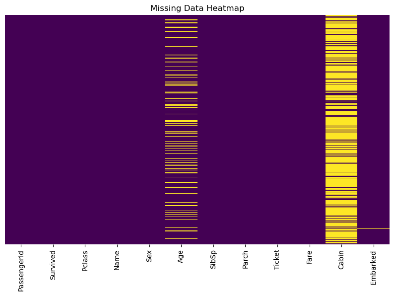
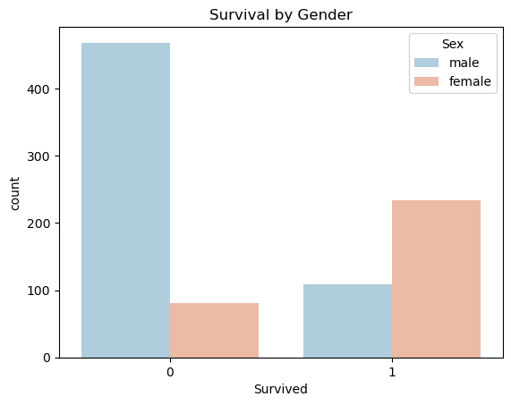
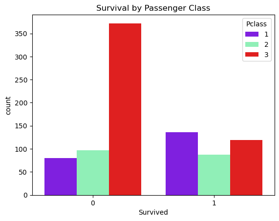
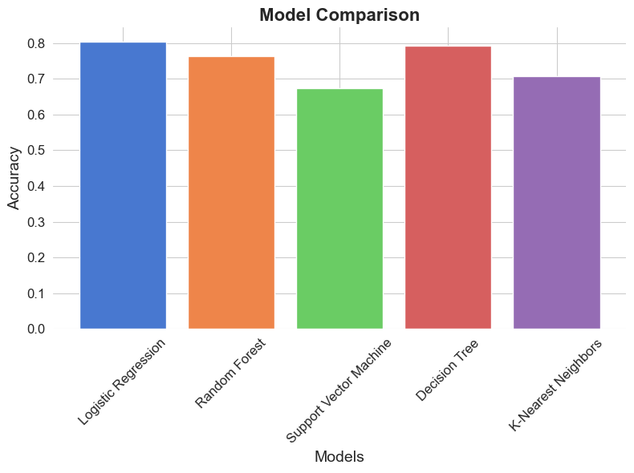
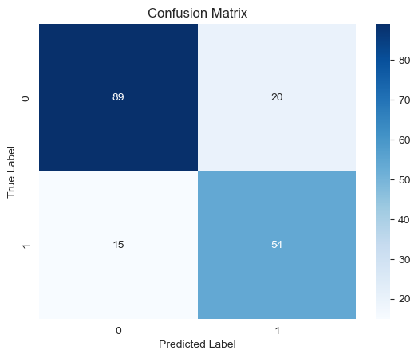

# Titanic Survival Prediction - Machine Learning Portfolio Project

## Project Overview

This project aims to predict the survival of passengers aboard the Titanic using various machine learning models. The dataset comes from the well-known [Kaggle Titanic Challenge](https://www.kaggle.com/c/titanic), which provides features such as age, gender, and socio-economic class to predict the likelihood of survival. The primary objective of this project is to compare different machine learning algorithms and select the most accurate one for prediction.

## Table of Contents
- [Project Overview](#project-overview)
- [Data Overview](#data-overview)
- [Methodology](#methodology)
  - [Data Cleaning and Preparation](#data-cleaning-and-preparation)
  - [Model Comparison](#model-comparison)
- [Results](#results)
  - [Best Model](#best-model)
- [Conclusion](#conclusion)
- [Graphs and Visualizations](#graphs-and-visualizations)
- [How to Run the Code](#how-to-run-the-code)

## Data Overview

The dataset consists of the following columns:
- **Pclass**: Ticket class (1st, 2nd, 3rd)
- **Sex**: Gender of the passenger
- **Age**: Age of the passenger
- **SibSp**: Number of siblings/spouses aboard
- **Parch**: Number of parents/children aboard
- **Fare**: Fare paid for the ticket
- **Embarked**: Port of embarkation (C = Cherbourg; Q = Queenstown; S = Southampton)
- **Survived**: Target variable (0 = No, 1 = Yes)

## Missing Data

The dataset contains missing values in certain columns. Here's a summary of the missing data in the dataset:

| Feature   | Missing Values |
|-----------|----------------|
| PassengerId | 0          |
| Survived    | 0          |
| Pclass      | 0          |
| Name        | 0          |
| Sex         | 0          |
| Age         | 177        |
| SibSp       | 0          |
| Parch       | 0          |
| Ticket      | 0          |
| Fare        | 0          |
| Cabin       | 687        |
| Embarked    | 2          |

The distribution and concentration of missing values across features is visualized in the heatmap below:

---

## Methodology

### Data Cleaning and Preparation

To prepare the data for machine learning models, the following steps were taken:

- **Age**: Imputed missing values with the median age based on passenger class. This strategy was chosen to account for potential age-related differences in survival rates across classes.
  
- **Cabin**: The `Cabin` column was dropped due to a large number of missing values (about 77%). Since filling this many missing values could introduce bias, it was decided to exclude this feature from the analysis.
  
- **Sex and Embarked**: These categorical variables were transformed into numerical representations using dummy variables (e.g., male = 1, female = 0). Dummy encoding allows machine learning models to process categorical data effectively.

- **Pclass**: Although the `Pclass` feature is represented as numerical values (1, 2, 3), it actually indicates categories (1st, 2nd, and 3rd class of passengers). To ensure that it is treated as a categorical feature rather than a continuous numerical variable, `Pclass` was converted into a categorical data.

---

This approach ensures that the dataset is clean and ready for model training, providing a solid foundation for building accurate predictive models.

### Survival Rate by Gender and Passenger Class

Survival rates were significantly affected by gender and socio-economic status (as indicated by passenger class). This section analyzes how these factors influenced the likelihood of survival during the Titanic disaster.

#### 1. Survival Rate by Gender

Gender played a crucial role in determining survival. The Titanic evacuation followed the "women and children first" policy, leading to a higher survival rate among female passengers.

- **Male survival rate**: Much lower than that of females, as men were generally given lower priority during the evacuation.
- **Female survival rate**: Significantly higher, reflecting the priority given to women during the rescue operations.

| Gender  | Survived (%) | Not Survived (%) |
|---------|--------------|------------------|
| Male    | 18.89%       | 81.11%           |
| Female  | 74.20%       | 25.80%           |

This table shows that **74.20%** of female passengers survived, while only **18.89%** of male passengers survived, which confirms the "women and children first" evacuation strategy.

#### 2. Survival Rate by Passenger Class

Passenger class also had a significant impact on survival rates, as wealthier passengers in higher classes were generally closer to lifeboats and may have had better access to evacuation points.

| Passenger Class | Survived (%) | Not Survived (%) |
|-----------------|--------------|------------------|
| 1st Class       | 62.96%       | 37.04%           |
| 2nd Class       | 47.28%       | 52.72%           |
| 3rd Class       | 24.24%       | 75.76%           |

The table highlights that **1st Class passengers** had the highest survival rate at **62.96%**, while **3rd Class passengers** had the lowest survival rate at **24.24%**. This reflects the socio-economic disparity present at the time, where wealthier passengers were prioritized in rescue efforts.

#### Insights:
- **Class Disparity**: Passengers in 1st Class had more favorable survival rates, likely due to better access to lifeboats and a higher priority in rescue efforts.
- **Gender Disparity**: Female passengers had significantly higher survival rates than male passengers, consistent with the "women and children first" approach.

---

### Model Comparison

I evaluated the following machine learning models:
- **Logistic Regression**
- **Random Forest Classifier**
- **Support Vector Machine (SVC)**
- **Decision Tree Classifier**
- **K-Nearest Neighbors (KNN)**

I split the data into training and validation sets (80% training, 20% validation) and compared the models using accuracy scores.

## Results

### Best Model

After testing multiple models, **Logistic Regression** was the best-performing model with an accuracy of **80.34%**. The runner-up was the **Decision Tree** model with an accuracy of **79.78%**.

| Model                    | Accuracy  |
|---------------------------|-----------|
| Logistic Regression        | 0.8034    |
| Decision Tree              | 0.7978    |
| Random Forest              | 0.7697    |
| K-Nearest Neighbors (KNN)  | 0.7079    |
| Support Vector Machine     | 0.6742    |

The results suggest that Logistic Regression, a simple yet powerful linear model, works best for predicting survival on this dataset. The Decision Tree also performed well and offers interpretability in decision-making, but Logistic Regression edges it out in terms of accuracy.

---

### Logistic Regression Model Performance

The **classification report** for Logistic Regression is as follows:

| Metric      | Precision | Recall | F1-Score | Support |
|-------------|-----------|--------|----------|---------|
| **Class 0** | 0.86      | 0.82   | 0.84     | 109     |
| **Class 1** | 0.73      | 0.78   | 0.76     | 69      |
| **Accuracy**|           |        | 0.80     | 178     |
| **Macro Avg**| 0.79     | 0.80   | 0.80     | 178     |
| **Weighted Avg** | 0.81  | 0.80   | 0.80     | 178     |

#### Key Insights:
- **Precision** for Class 0 (Non-survivors) is **0.86**, indicating that when the model predicts a passenger did not survive, it is correct 86% of the time. However, precision for Class 1 (Survivors) is slightly lower at **0.73**.
- **Recall** for Class 1 is **0.78**, meaning the model correctly identifies 78% of the actual survivors. For Class 0, recall is **0.82**.
- The **F1-score** balances precision and recall, with **0.84** for Class 0 and **0.76** for Class 1. This highlights a slight imbalance in the model's ability to predict survivors versus non-survivors.
- The **accuracy** of the model is **80%**, indicating that the Logistic Regression model correctly predicts the survival status for 80% of the passengers.

---

#### Confusion matrix:

- **True Positives (54)**: The model correctly predicted 54 passengers as survivors.
- **True Negatives (89)**: 89 passengers were correctly classified as non-survivors.
- **False Positives (20)**: The model mistakenly predicted 20 passengers as survivors, though they did not survive.
- **False Negatives (15)**: The model incorrectly predicted that 15 passengers did not survive, when they actually did.

The confusion matrix suggests that the model is slightly better at predicting non-survivors (Class 0) than survivors (Class 1), as indicated by the higher number of true negatives and a slightly lower number of false negatives.

---

### Conclusion

The **Logistic Regression** model offers a solid balance between simplicity and performance. It achieved an accuracy of **80%**, with good performance metrics across precision, recall, and F1-score. While there is a small imbalance in the prediction of survivors versus non-survivors, the model is still effective in both classes. 

The confusion matrix indicates that while the model makes some mistakes in predicting survivors, it performs well overall. To further improve performance, techniques like **hyperparameter tuning**, **feature engineering**, or **cross-validation** could be explored. 

Further steps could include hyperparameter tuning, feature engineering, or testing additional algorithms to push the performance even higher.
---
